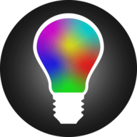
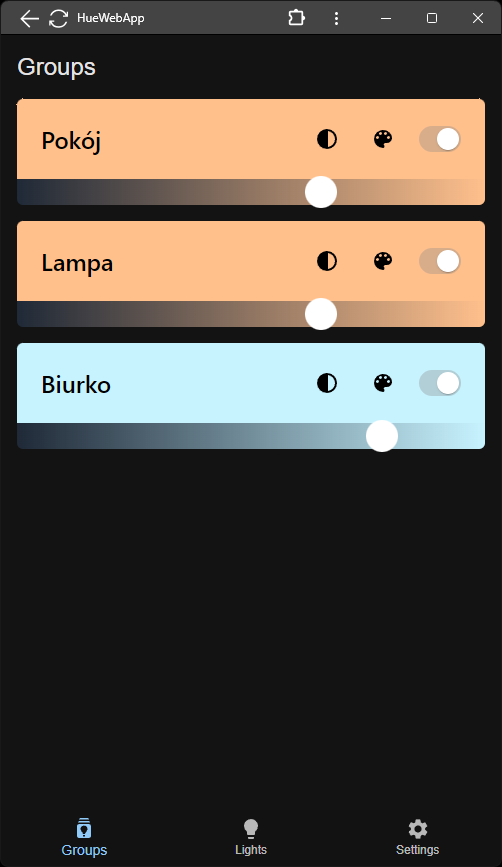
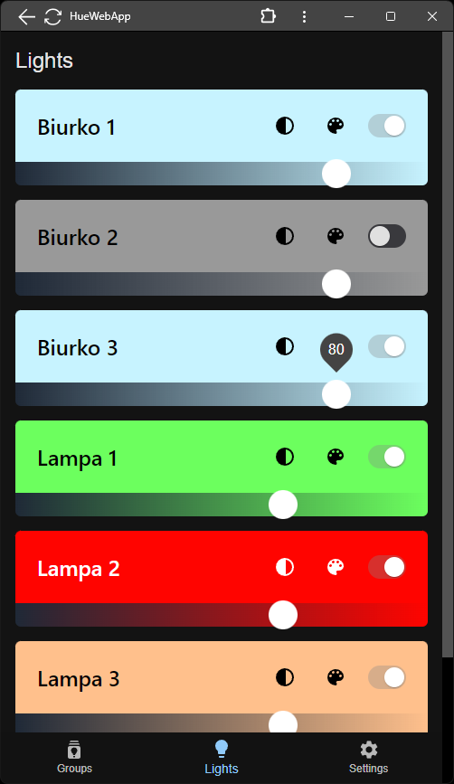
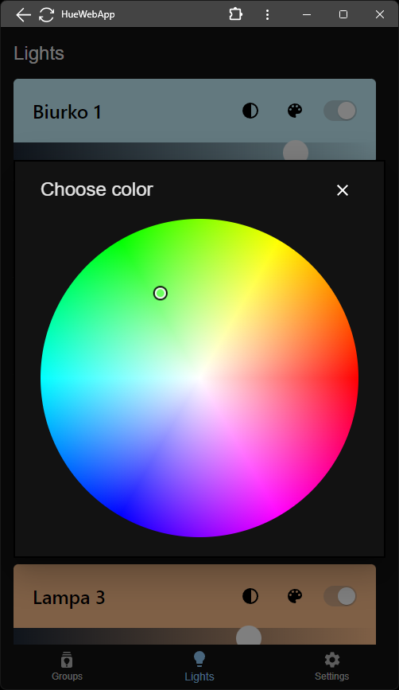
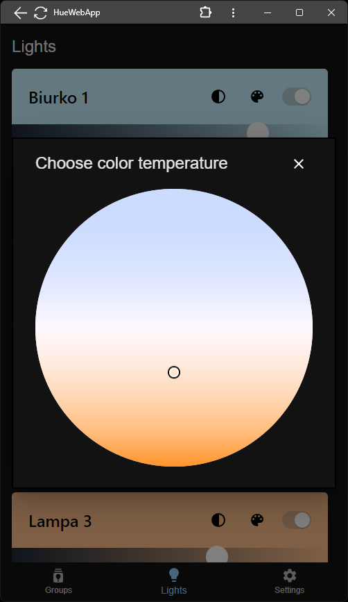

<p align="center">
  
  <h1 align="center">HueWebApp</h1>
</p>

Control your Philips Hue lights

Web app made with React/Next.js


### Installation with Docker

Run commands in this repo directory:
```
docker build -t huewebapp .
docker run -p YOURPORT:3000 huewebapp
```

## Screenshots
<p>
  
  
</p>
<p>
  
  
</p>
